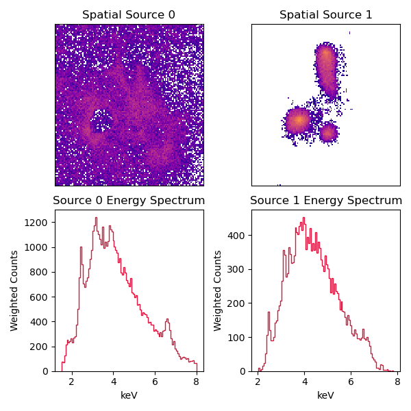
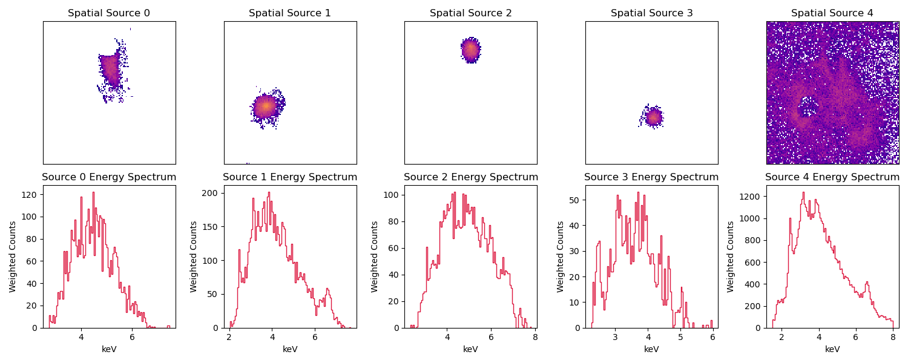

# DOGS (DOuble GMM Starlet) source separation technique

In the crowded center of the Milky Way, it can be difficult to pick out specific objects for spectral and energy analysis. Blind source separation (BSS) allows for extracting scientifically meaningful observations about astrophysical objects. Traditional BSS methods, and more recent methods such as Generalized Morphological Component Analysis, struggle to extract compact and smooth separations in busy areas. In this work, we introduce a sequence of starlet-fitted Gaussian Mixture Models (GMMs), a flexible BSS framework that exploits the adaptable GMM probability fitting for multiple levels of structure from starlets. The framework first splits background from more compact objects and then splits the foreground objects into independent components. We use this separation framework to evaluate the spectral properties of distinct physical objects: Sgr A*, a pulsar wind nebula, star cluster, and the plasma environment in which they are embedded. It is generalizable, even allowing for splitting a pulsar wind nebula from its tail. Our results show the potential of this method for any astronomical observations and allows for extremely flexible fitting to new energy distributions.

# Preliminary Results

Below is the successful separation of the galactic core using DOGS.

### Stage 1 of separation (background split from objects)

### Stage 2 of separation (objects split from each other)

__Source 0:__ tail of the pulsar wind nebula

__Source 1:__ black hole, Sagittarius A*

__Source 2:__ core of the pulsar wind nebula

__Source 3:__ star cluster

# Authors
Salem Loucks, Lia Corrales, Jamila Taaki, Mayura Balakrishnan, *University of Michigan*
